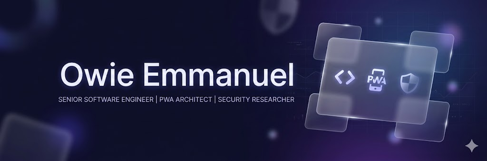
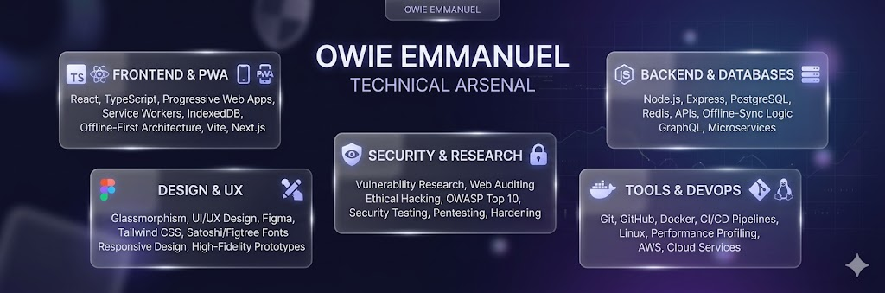

# Hello, I'm Owie Emmanuel 🚀

### Software Engineer | PWA Architect | Security Researcher

I specialize in building resilient, offline-first web applications and conducting deep-dive security audits. My work sits at the intersection of high-fidelity UI/UX and rigorous backend logic, focusing on performance-optimized architectures and user privacy.

---

### 🛠️ Technical Arsenal

| Category | Technologies |
| :--- | :--- |
| **Frontend & PWA** | React, TypeScript, Service Workers, IndexedDB, PWA Architecture |
| **Design System** | Glassmorphism, Midnight Dark Themes, Figma, Satoshi, Figtree |
| **Security** | Vulnerability Research, Web Auditing, Ethical Hacking, OWASP Top 10 |
| **Backend/DB** | Node.js, PostgreSQL, Redis, Offline-Sync Logic |
| **Tools** | Git, Docker, Linux, Performance Profiling |

---

### 🧪 Featured Projects

#### [Waverr 2.0](https://github.com/Owie6789/waverr-preview)
**Lead Developer & UI Designer**
An offline-first, professional-grade music player built as a Progressive Web App.
* **Key Features:** Advanced shuffle algorithms, complex IndexedDB schema management, and a custom "Midnight Glass" UI.
* **Tech:** HTML, PWA, CSS Glassmorphism.
---

### 🎨 Design Philosophy
I believe that software should be as beautiful as it is functional. My design language often utilizes:
* **Themes:** Deep bluish-purple palettes and "Midnight Glass" aesthetics.
* **Typography:** Satoshi, Figtree, and Google Sans for maximum readability and modern feel.
* **Interaction:** Smooth, high-performance animations and glassmorphic layers.

---

### 📊 GitHub Stats

---

### 📫 Connect with Me
-  Email: owieemmanuel34@gmail.com

*"Building the future of the web, one secure PWA at a time."*

feat: initial profile setup
