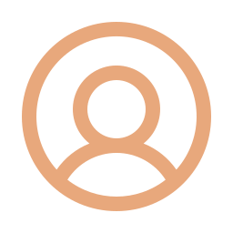
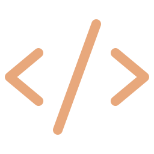
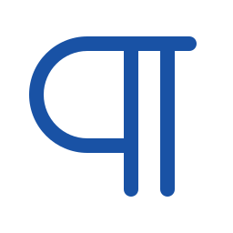
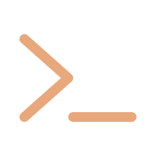
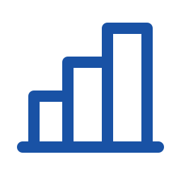

<!-- ANIMATED HEADER -->

<!-- TYPING BIO -->

  

  

---

 **about**

> privacy-first software. offline-first architecture. clean design that actually works.

 

 **arsenal**

  

  
  
  
  
  
  
  
  
  

 

 **featured**

| | project | stack |
|---|---|---|
|  | [**Waverr**](https://github.com/Owie6789/waverr-preview) - offline-first audio engine with 10-band EQ, spectrogram |   |
|  | [**textsplit**](https://github.com/Owie6789/textsplit) - zero-dep text split tool, 5 methods, 1M+ chars |   |
|  | [**gsd-command-router**](https://github.com/Owie6789/gsd-command-router) - interactive CLI docs for 50+ GSD commands |   |
|  | [**bio**](https://github.com/Owie6789/bio) - retro-OS interactive portfolio, pixel art, virtual pet |   |

 

 **stats**

  
  

  

  

 

 **contributions**

<picture>
  <source media="(prefers-color-scheme: dark)" srcset="https://raw.githubusercontent.com/Owie6789/Owie6789/output/snake-dark.svg" />
  <source media="(prefers-color-scheme: light)" srcset="https://raw.githubusercontent.com/Owie6789/Owie6789/output/snake.svg" />
  
</picture>

 

 **metrics**

---

<!-- FOOTER -->

  
  &nbsp;
  

  icons by <a href="https://phosphoricons.com">Phosphor</a> &middot; header by <a href="https://github.com/kyechan99/capsule-render">Capsule Render</a>

