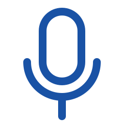
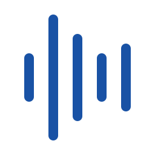

<!--
  palette
  accent        1952a5   icon fills, badge bodies, gradients, borders
  accent-light  71A2EA   text and thin strokes on dark
  accent-bright 4C8BE0   secondary accents
  bg            0F172A   panels, header, footer
  surface       1E293B   badge label backgrounds
  border        334155   hairlines
  text          E2E8F0   primary text
  muted         94A3B8   secondary text
-->

<!-- ANIMATED HEADER -->

<!-- TYPING BIO -->

 

  <i>" I can do all this through him who gives me strength. "</i>   
  <code>Philippians 4:13</code>

 

---

 **about**
 

> privacy-first software, with offline-first architecture, and very well seasoned design taste.

 

&nbsp;&nbsp;&nbsp;&nbsp;&nbsp;&nbsp;&nbsp; Most of what I make starts from the same complaint, I want to use a tool and it asks for an account or an outrageous subscription before it does the one job I opened it for, so I ofc build the version that solves that exact problem, stays free and open-saus while still being very well designed( ..trust me, I hate AI slop as much as you do). *mausVoice* [**↱**](https://github.com/maus-inc/mausVoice) can transcribe with local Whisper and make zero network calls(/or with free cloud endpoints) while doing it while still (in my humble opinion) being a very pristine, accurate, fast and free open-source alternative to productivity tools like WisprFlow, SuperHuman, and other "Freemium" and "Pro-subscription" gated STT tools. *textsplit* [**↱**](https://github.com/Owie6789/textsplit) is a single HTML file with nothing to install while helping me split enormous chunks of text, Ad/Bloat-free+No Install needed, and I am not planning to stop anytime soon. At 16, the sky is literally the baseline of my limits!

Right now, I maintain *mausVoice* [**↱**](https://github.com/maus-inc/mausVoice) at maus-inc and I also collaborate heavily over at *Nora* [**↱**](https://github.com/Sandakan/Nora). Great tools don't always have to be pay-for-a-monthly-sub, and I'll keep dedicating my time, effort and resources to keeping "free", great.

...and least I forget, I ship more than you 😭✌️🥀

 

> thank you for taking your time to read through this, you can find more info as you scroll bellow, check out projects i've worked on, leave a star if you find them useful, and maybe even drop a follow👍. Have a wonderful day.

Last Updated - 3rd, September '26

 
 

 **arsenal**

 
 

 **featured**

| | projects | stack |
|---|---|---|
|  | [**mausVoice**](https://github.com/maus-inc/mausVoice) - desktop voice dictation, Rust core, local Whisper option, AI cleanup |    |
|  | [**Nora**](https://github.com/Sandakan/Nora) - music player I collaborate on, [live demo](https://noramusic.netlify.app) |    |
|  | [**textsplit**](https://github.com/Owie6789/textsplit) - zero-dep text split tool, 5 methods, 1M+ chars |   |
|  | [**Waverr**](https://github.com/Owie6789/waverr-preview) - offline-first audio engine with 10-band EQ, spectrogram |   |
|  | [**bio**](https://github.com/Owie6789/bio) - retro-OS interactive portfolio, pixel art, virtual pet |   |
|  | [**gsd-command-router**](https://github.com/Owie6789/gsd-command-router) - interactive CLI docs for 50+ GSD commands |   |

 
 

 **stats**

 
 

 **contributions**

<table width="100%">
<tr>
<td align="center" style="border: 1px solid #1952a5; border-radius: 8px; padding: 15px; background-color: #0F172A;">
<picture>
<source media="(prefers-color-scheme: dark)" srcset="https://raw.githubusercontent.com/Owie6789/Owie6789/output/snake-dark.svg" />
<source media="(prefers-color-scheme: light)" srcset="https://raw.githubusercontent.com/Owie6789/Owie6789/output/snake.svg" />

</picture>
</td>
</tr>
</table>

 
 

 metrics

 connections

 

---

<!-- FOOTER -->

&nbsp;

icons by <a href="https://phosphoricons.com">Phosphor</a> &middot; header by <a href="https://github.com/kyechan99/capsule-render">Capsule Render</a>

